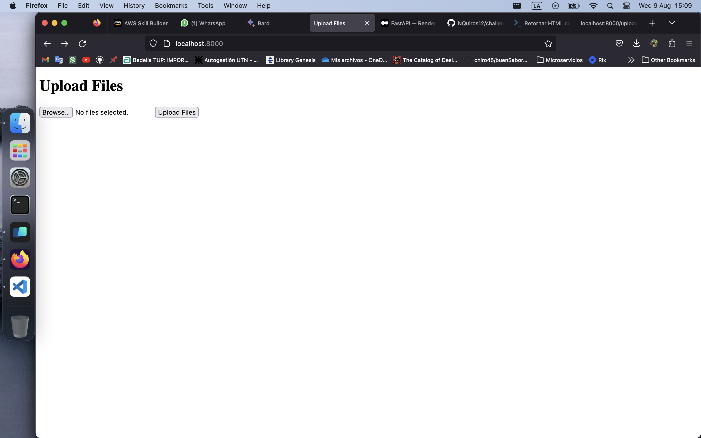

# README
This is my solution for Globant's data engineer evaluation.

I created this API using **MySQL** as the database and **FastAPI** with **Python** as the programming language. It provides functions for loading a CSV file and batch loading its data into the database. Additionally, it has one endpoint for each query in the second section, as required. I also added some additional CRUD functions and endpoints to the API.
It has the endpoints to upload the files to a directory. And another endpoint for batch_upload to **SQL** database
To run this API run:

```
python -m venv fastapi
source fastapi/bin/activate
pip install -r requirements.txt
# Start the db
docker build -t my-mysql .
docker run -d -p 3307:3306 --name sqldb  my-mysql
# Start the API
uvicorn main:app --reload
``` 
 <br>
I created a client html file to make it easy to use the API. It can also be tested using *POSTMAN* or CURL.
All you have to do is go to localhost:8000
This should show this:



There browse for your files and upload them.

## Bonus Part
As for the bonus part, I have implemented several tests in the "test" directory.
The available tests are:

* A test for connection to the database.
* A test for the upload_csv function to verify data is uploaded to the database.
* A test for batch loading of the database, which first deletes all the tables (the delete_all_tables function is ONLY for this test).
* A test for duplicate data in the hired employees table.
* A test for the number of rows in the tables.
* A test to ensure that the queries requested in section 2 of the evaluation return a code 200, which means everything is working fine. I don't think it's necessary or optimal to view the query results themselves, as they will be tied to the contents of the table and its changes over time. 

To run these tests, navigate to the root directory and execute: 
```
pytest test/testing.py
```
### For the rest of the bonus:
Regarding the docker part, I have created a dockerfile file to create a Docker container with a MySQL database.

In terms of storing this API in the cloud, I have been exploring free deployment options. I found that "Railway" is a good choice, but unfortunately, I don't have time to learn about it and do it.